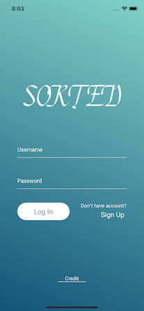
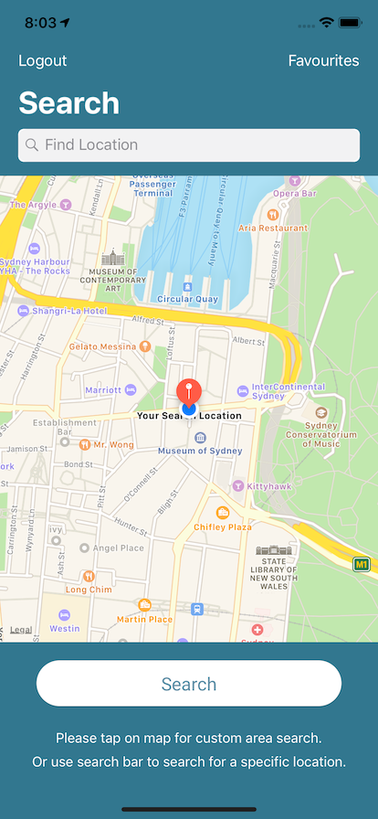
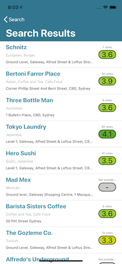
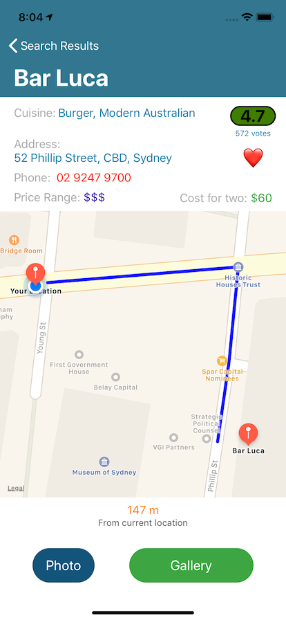
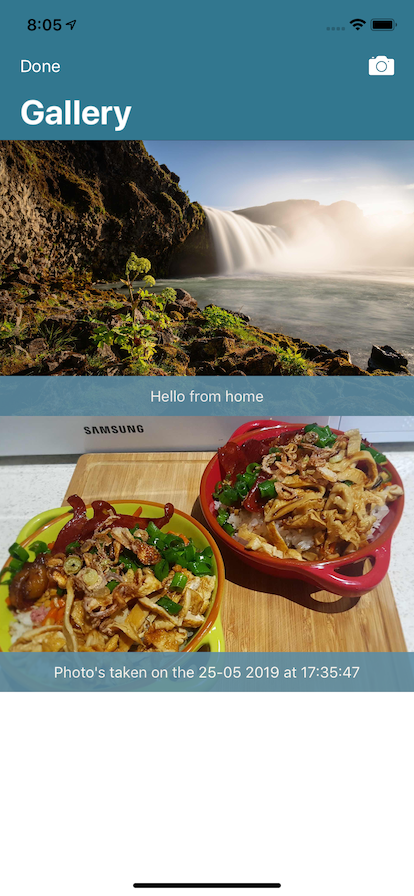
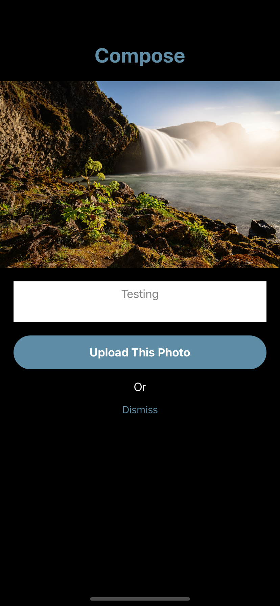
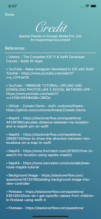

Sorted
======

It is my last project for Uni.

It is based on the Zomato app that is available on the App Store. It provides a comprehensive way to search for restaurants around an area. For me, its UI is very condensed and displays a lot of unnecessary information. 

**Sorted** is a strip down version that provides a simpler interface than the original app. With a straightforward searching method, this app only shows you all the info you need. The UI is followed the Material Design concept.

Description
======

What the app _can_ do:
* Signup for account which will fetch all your saved restaurants
* Search restaurants around your current location/custom locations include tap onscree or search by name.
* Show the first 20 or 40 results
* Show selected restaurant's details
* Able to add to your personal favourite list
* With favourite restaurants, you can capture images and save to the cloud storage which can retrieve from any devices

What the app _can't_ do:
* Have the same capability as the OEM app
* Retrieve details which is only available for commercial apps
* Can't exceed 1000 calls/day/API

What I _will_ do in the future:
* Contact Zomato to commercialise the app
* Keep the app up-do-date as much as possible - if it wasn't sold on the Apps Store.

What you _could_ do:
* Fork it, play with it, make it better, etc. But, please don't forget to give me a shout-out or a small place in your heart ;).

#### Notes: What you need to do is add your own 'GoogleServiceInfo.plist' file, and 'API key' (which you can obtain free from Zomato developer website) to make the app functioning.

API key should be added in the file below:
* SearchTableViewController.swift - line 59
* FavouriteTableViewController.swift - line 152

Screenshot
======

