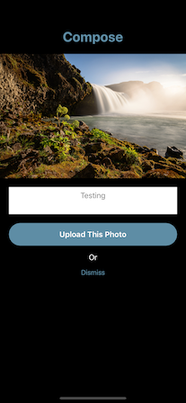

Sorted
======

It is my last project for Uni.

It is based on the Zomato app that is available on the App Store. It provides a comprehensive way to search for restaurants around an area. For me, its UI is very condensed and displays a lot of unnecessary information. 

**Sorted** is a strip down version that provide a simpler interface than the original app and straightforward searching method. The UI is follow the Material Design concept.

#### Notes: What you need to do is add your own 'GoogleServiceInfo.plist' file, and 'API key' (which you can obtain free from Zomato developer website) to make the app functioning.

Screenshot
======

{:width="100px"}

